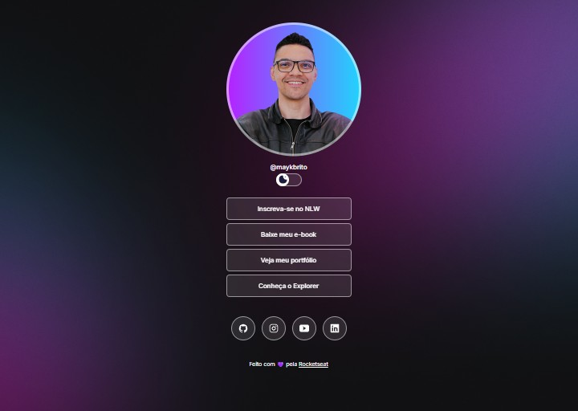

<h1 align="center">
  DevLinks
</h1>

  

## 💜 Sobre o projeto

DevLinks é uma página pessoal de links, inspirada no modelo do Linktree, desenvolvida durante um treinamento gratuito e exclusivo promovido pela Rocketseat para ensino de HTML, CSS e JavaScript.

A página reúne, em um único lugar, links úteis (redes sociais, portfólio, materiais), com suporte a modo claro e escuro alternável por um botão de switch.

## 🚀 Tecnologias utilizadas

Esse projeto foi desenvolvido utilizando as seguintes tecnologias:

- HTML
- CSS
- JavaScript
- Git e GitHub
- [Figma](https://www.figma.com/design/FXs4YNwXdun6WkUQj7JYlP/DevLinks-%E2%80%A2-Projeto-Discover--Community-) (para o layout)

## 🔖 Layout

Você pode visualizar o layout do projeto através [DESSE LINK](https://www.figma.com/design/FXs4YNwXdun6WkUQj7JYlP/DevLinks-%E2%80%A2-Projeto-Discover--Community-). É necessário ter uma conta no [Figma](https://figma.com) para acessá-lo.

## 💻 Projeto

O projeto DevLinks foi desenvolvido durante o treinamento de HTML, CSS e JavaScript da Rocketseat, com o objetivo de ensinar os fundamentos do desenvolvimento web na prática.

## :memo: Licença

Esse projeto está sob a licença MIT. Veja o arquivo [LICENSE](LICENSE) para mais detalhes.

---

Feito com 💜 pela [Rocketseat](https://rocketseat.com.br). Participe da nossa comunidade!
